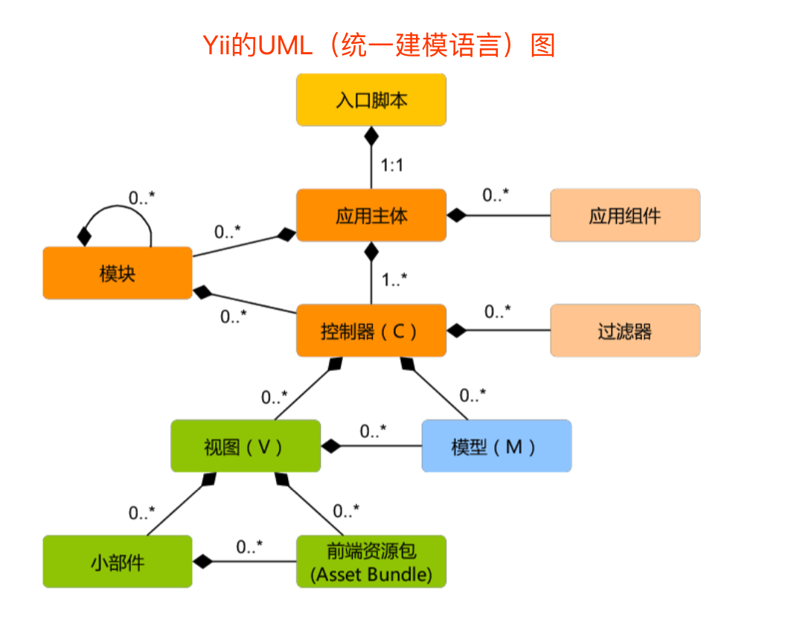

# ❤️图书管理系统❤️

## 1.MVC模式

####框架的意义：提供一个基础设施

####CS结构：client（客户端） / servere（服务器） 结构

####BS模式：browser（浏览器） / server（服务器） 结构

####1⃣️MVC运行逻辑（闭环）：


**Model**—>updates（更新）—>**view**—>see（给用户看）—>**user**—>uses—>**Controllers**—>manipulates(控制)—>**Model**

####2⃣️一个典型的WEB MVC的流程：

-  Controller截获用户发出的请求
-  Controller调用Model完成状态的读写操作
-  Controller把数据传递给View
-  View渲染最终结果并呈现给用户

**js不适合做计算密集型的事儿，适合做IO密集型的事儿**

####3⃣️数据流的概念：

- 软件的本质：是算法加数据结构，把view抛出，核心只有两块，**数据**和**算法**，涉及到软件设计层面上，实际上它的本质是**数据流**

- 数据流：是以数据为主体，指的是**数据**从哪儿产生，送到什么地方去，然后从哪儿加工，然后再送到什么地方去，数据流对应的就是业务，controller对应的书数据处理逻辑

  

## 2.基于yii2的图书管理系统

#### 1⃣️环境安装操作步骤

- 配置好xampp环境
- 下载yii2 basic https://www.yiiframework.com/download
- 修改config/web.php文件，给**cookieValidationKey**配置项 添加一个密钥，内容随意，为了配置cookie，如果是通过composer安装的yii2，则忽略
- 保证yii安装目录的访问权限（windows无所谓，但是Mac和Linux必须要给读写权限）
- 通过浏览器访问web路径 /web/index.php 打开yii应用， 可以看到主页面

#### 2⃣️Yii环境基本配置

- 配置数据库连接。修改config/db.php中的配置参数【'dbname'，'username'】

  ```php
  return [
      'class' => 'yii\db\Connection',
      'dsn' => 'mysql:host=localhost;dbname=db_book',
      'username' => 'root',
      'password' => 'root',
      'charset' => 'utf8',
    ];
  ```

- 激活Gii模块。修改config/web.php，找到以下代码，并检查

  ```php
  if (YII_ENV_DEV) {
      $config['bootstrap'][] = 'gii';
      $config['modules']['gii'] = [
          'class' => 'yii\gii\Module',
      ];
  }
  ```

- 检查应用的入口脚本web/index.php，找到下边这行代码将**YII_ENV_DEV**设置为true，如果没找到，则可能是版本的问题，已经帮配好了，加上这下面这行代码就可以了

  ```php
  defined('YII_ENV') or define('YII_ENV_DEV', true);
  ```

- 在开发模式下，按照上面的配置会激活Gii模块。直接通过URL访问Gii

  ```php
  http://hostname/index.php?r=gii
  ```

- 通过本机以外的机器访问Gii，请求会被处于安全原因拒绝。可以在config/web.php中为Gii添加允许访问的IP

  ```php
  'gii'=>[
  'class' => 'yii\gii\Module',
  'allowedIPs' => ['127.0.0.1', '::1', '192.168.0.*', '10.0.0.*'] // 按需调整这⾥
  ```

  ⚠️**注意：**数据库中的字符集一般用**utf8_general_ci**，如果为了可以兼容表情符号（emojy），则要选择**utf8_mb4**

#### 3⃣️Yii调试器介绍


#### 4⃣️Gii操作界面介绍


#### 5⃣️Yii项目结构介绍

- config 配置文件
- Controllers 控制器
- view 视图层
- model 数据层

## 3.Yii中的MVC

#### 1⃣️Yii静态结构



#### 2⃣️生命周期


- 用户向入口脚本**web/index.php**发起请求
- 入口脚本加载应用配置并创建一个应用实例去处理请求
- 应用通过请求组件解析请求的路由
- 控制器创建一个动作实例并针对操作执行过滤器
- 如果任何一个过滤器返回失败，则动作取消
- 如果所有过滤器都通过，动作将被执行
- 动作会加载一个数据模型，或许是来自数据库
- 动作会渲染一个视图，把数据模型提供给它
- 渲染结果返回给相应组件
- 响应组件发送渲染结果给用户浏览器

## 4.使用Gii生成MVC代码

#### 1⃣️生成model

####2⃣️生成CRUD（增删改查）代码


## 5.源码讲解MVC

#### 1⃣️Gii生成的代码

#### 2⃣️通过Yii调试器分析MVC的流程

