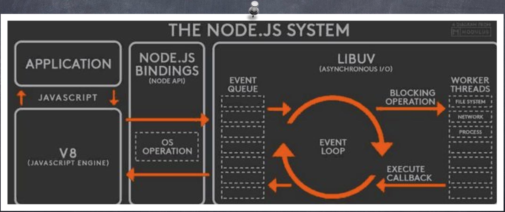
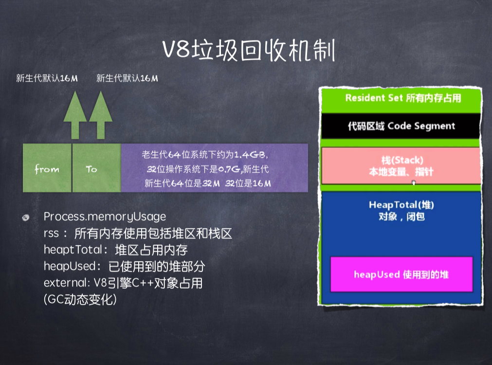

# ❤️大规模NodeJS项目架构与优化❤️

## 1.使用nodejs的好处

- 削减api

- 测试接口

- 提高性能

**BFF模型**:前端直接对接node层   做到前后端分离

## 2.NodeJS异步IO原理浅析及优化方案

### 1⃣️异步IO的是与非

- **异步IO的好处**

  + 前端通过异步IO可以消除UI堵塞   
  + 假设请求资源A的时间为M，请求资源B的时间为N，那么同步的请求耗时为M+N，如果采用异步方式占用时间为Max（M，N）
  + 随着业务的复杂，会引入分布式系统，时间会线性的增加，M+N+…….和Max（M，N），这会放大同步和异步之间的差异
  + I/O是昂贵的，分布式I/O是更昂贵的
  + NodeJS适用于IO密集型不适用CPU密集型

- 一些底层的知识

  + 

    CPU 时钟周期：1  /  CPU主频——> 1s  /  2.7GHz

  + 

    P 是并行系统中的处理器数量；  p可以是无穷大的

    f = Ws/W 为串行部分的比例；  s = 1 / f

  + 

    操作系统对计算机进⾏行行了了抽象，将所有输⼊入输出设备抽 象为⽂文件。内核在进⾏行行⽂文件I/O操作时，通过⽂文件描述符进 ⾏行行管理理。应⽤用程序如果需要进⾏行行IO需要打开⽂文件描述符， 在进⾏行行⽂文件和数据的读写。异步IO不不带数据直接返回，要 获取数据还需要通过⽂文件描述符再次读取 。 				 			 		

### 2⃣️Node对异步IO的实现

​		完美的异步IO应该是应用程序发起非阻塞调用，无需通过遍历或者事件循环等方式轮询。



**LIBU**:负责管理调度

**Node事件循环的六个阶段：**

- timers阶段：这个阶段执行已经到期的timer(setTimeout、setInterval)回调

- I/O callbacks阶段：执行I/O（例如文件、网络）的回调

- idle, prepare 阶段：node内部使用

- poll阶段：获取新的I/O事件, 适当的条件下node将阻塞在这里

- check阶段：执行setImmediate回调

- close callbacks阶段：执行close事件回调，比如TCP断开连接

**文件描述符：**

​		在linux下一切皆文件，文件描述符是内核为了高效的管理已经被打开的文件所创建的索引，它是一个非负整数，用于指代被打开的文件，所有执行I/O操作的系统调用都是通过文件描述符完成的。 
​		在linux中，进程是通过文件描述符(file descriptors 简称fd)来访问文件的，文件描述符实际上是一个整数。在程序刚启动的时候，默认有三个文件描述符，分别是：0(代表标准输入)，1(代表标准输出)，2(代表标准错误)。再打开一个新的文件的话，它的文件描述符就是3。POSIX标准规定，每次打开的文件时(含socket)必须使用当前进程中最小可用的文件描述符号码。

### 3⃣️几个特殊的API

```js
// 观察者来管理setTimeout和Setimmdiate
setTimeout(function () {
    console.log(1);
}, 10); // 当延时是0的时候 优先级就高 setTimeout就排在setImmediate前
        // 当延时不是0的时候  优先级就低   setTimeout就在setimmediate后
setImmediate(function () {
    console.log(2);
});
// 3⃣️同步任务执行完毕以后执行nextTick
process.nextTick(() => {
    console.log(3);
});
new Promise((resovle, reject) => {
    // 1⃣️虽然promise是异步的   但是promise写的时候是同步的   只有then是异步的
    console.log(4);
    resovle(4);
}).then(function () {
    // 4⃣️then比setTimeout和setImmediate优先级要高
    console.log(5);
});
// 2⃣️
console.log(6);
// 4
// 6
// 3
// 5
// 1
// 2
```

- SetTimeout和SetInterval线程池不参与   V8中的观察者管他俩

- **Process.nextTick()** 实现类似SetTimeout(function(){},0);每次调用放入队列中，在下一轮循环中取出

- SetImmediate()比Process.nextTick()优先级低

- Node如何实现一个sleep?

- ```js
  async function test() {
      console.log('Hello');
      await sleep(1000);
      console.log('world!');
  };
  function sleep(ms) {
      return new Promise(resolve => setTimeout(resolve, ms));
  }
  test();
  ```

### 4⃣️函数式编程在Node中的应用

- **1.高阶函数**:可以将函数作为输入或者返回值，形成一种 后续传递风格的结果接受方式，而非单一的返回值形式。 后续传递风格的程序将函数业务重点从返回值传递到回调 函数中。
  

  ```js
  app.use(function(){//todo})
  var emitter = new events.EventEmitter;
  emitter.on(function(){//..........todo})
  ```

- **2.偏函数：**指定部分参数产生一个新的定制函数的形式就是偏函数。Node中异步编程非常常见，我们通过**哨兵变量**（var a = 0）会很容易造成业务的混乱。underscore，after变量

### 5⃣️常用的Node控制异步API的技术手段

- Step、wind(提供等待的异步库)、Bigpipe、Q.js 

- Async、Await 

- Promise/Defferred是一种先执行异步调用，延迟传递的处理方式。Promise是 高级接口，事件是低级接口。低级接口可以构建更多复杂的场景，高级接口一 旦定义，不太容易变化，不再有低级接口的灵活性，但对于解决问题非常有效 

- 由于Node基于V8的原因，目前还不支持协程。协程不是进程或线程，其执行 过程更类似于子例程，或者说不带返回值的函数调用。 

- 一个程序可以包含多个协程，可以对比与一个进程包含多个线程，因而下面我们来比较协程和线程。我们知道多个线程相对独立，有自己的上下文，切换受系统控制;而协程也相对独立，有自己的上下文，但是其切换由看自己控制，由当前协程切换到其他协程由当前协程来控制。

## 3.NodeJS内存管理机制及内存优化

###	内存管理与优化

- **V8垃圾回收机制**（间歇性执行）

  + Node使用JavaScript在服务端操作大内存对象受到了一定的限制(堆 区)，64位系统下约为1.4GB，32位操作系统下是0.7G.    栈区新生代 64位是32M 32位是16M


    **栈区新生代：**

    ​		新生代：存活时间较短的对象

    ​		老生代：存活时间较长的对象

    ```js
    - node —max-new-space-size app.js
    
    - max-old-space-size app.js 
    ```

  + Process.memoryUsage->rss、heaptTotal、heapUsed 

  + V8的垃圾回收策略主要基于分代式垃圾回收机制。在自动垃圾回 收的演变过程中，人们发现没有一种垃圾回收算法能够胜任所有 场景。V8中内存分为新生代和老生代两代。新生代为存活时间较 短对象，老生代中为存活时间较长的对象。 

  + 一句话表示:小孩子尽管玩，到处丢东西大人收。

    

- **Scavenge算法**

  ```html
  		在分代基础上，新生代的对象主要通过Scavenge算法进行 垃圾回收，再具体实现时主要采用Cheney算法Cheney算法是一种采用复制的方式实现的垃圾回收算法。它将内存一分为二，每一个空间称为semispace。这两个semispace中一个处于使用，一个处于闲置。处于使用的称之为From, 闲置的称之为To.分配对象时先分配到From,当开始进行垃 圾回收时，检查From存活对象赋值到To.非存活被释放然后互换位置。再次进行回收，发现被回收过直接晋升或者发现To空间已经使用了超过25%。他的缺点是只能使 用堆内存的一半，这是一个典型的空间换时间的办法，但是新生代声明周期较短，恰恰就适合这个算法。		 			 		
  ```

  

- Mark-Sweep & Mark-compact（老生代采用的两种算法）

  ```
  		V8老生代主要采用Mark-Sweep和Mark-compact,在使 用Scavenge不合适。一个是对象较多需要赋值量太大 而且还是没能解决空间问题。Mark-Sweep是标记清 楚，标记那些死亡的对象，然后清除。但是清除过 后出现内存不连续的情况，所以我们要使用Mark- compact，他是基于Mark-Sweep演变而来的，他先将 活着的对象移到一边，移动完成后，直接清理边界 外的内存。当CPU空间不足的时候会非常的高效。 V8后续还引入了延迟处理，增量处理，并计划引入 并行标记处理。
  ```

  

- 何时启动GC

  

- 引用计数DEMO(快照查看)

  ```js
  function Yideng(name) { this.name = name;
  }
  //demo1
  let student1 = new Yideng(); 
  let student2 = new Yideng(); 
  setTimeout(function () {
  	student1 = null; 
  },3000);
  //demo2
  let student1 = new Yideng("zhijia"); 
  let ydSet = new Set(); 
  ydSet.add(student1)
  student1 = null;
  ydSet = null;
  
  //闭包在堆区
  let YidengFactory = function (name) {
  let student = new Yideng(name); return function () {
  console.log(student);
  let p1 = YidengFactory("老袁"); p1();
  p1 = null;
  ```

- 常见内存泄漏问题

  + 无限制增长的数组
  + 无限制设置属性和值
  + 任何模块内的私有变量和方法均是永驻内存的    a = null
  + 大循环，无GC机会

- 内存泄漏分析

  ```js
  node-inspector
  console.log("Server PID", process.pid);
  sudo node --inspect app.js
  while true;do curl "http://localhost:1337/"; done
  top -pid 2322
  ```

## 4.大规模Node站点结构原理分析

### 	1⃣️经典的MVC框架

​		

### 2⃣️NET多层架构

### 	3⃣️NET多层架构


### 	4⃣️JavaWeb多层架构


## 5.服务器集群管理与Node集群的应用

### 1⃣️预备上线

- 前端工程化的搭载动态文件的MAP分析压缩打包合并至CDN
- 单测、压测 性能分析工具发现Bug
- 编写nginx-conf实现负载均衡和反向代理
- PM2启动应用程序小流量灰度上线，修复BUG
- 上线前的不眠夜，你见过凌晨5点的北京么?

### 2⃣️多线程

- Master进程均为主进程，Fork可以创造主从进程。
- 通过child_process可以和NET模块组合，可以创建多个线程并监听统一端口。通过句柄传递完成自动重启、发射自杀信号、限量重启、负载均衡。**PM2做的是本机的负载均衡，nginx做的是网络层的负载均衡。**
- Node默认的机制是采用操作系统的**抢占式策略**。闲着的进程争抢任务，但是会造成CPU闲置的IO暂时并未闲置。Node后来引入了Round-Robin机制，也叫轮，叫调度。主进程接受任务，再发
- 每个子进程做好自己的事，然后通过进程间通信来将他们连接起来。这符合Unix的设计理念，每个进程只做一件事，并做好。将复杂分解为简单，将简单组合成强大。

### 3⃣️PM2

​		pm2 是一个带有负载均衡功能的Node应用的进程管理器. 当你要把你的独立代码利用全部的服务器上的所有CPU，并保证进程永远都活 着，0秒的重载。

 	1.内建负载均衡(使用Node cluster 集群模块)
​	 2.后台运行
​	 3.0秒停机重载
​	 4.具有Ubuntu和CentOS 的启动脚本
​	 5.停止不稳定的进程(避免无限循环)
​	 6.控制台检测
​	 7.提供 HTTP API
​	 8.远程控制和实时的接口API ( Nodejs 模块,允许和PM2进程管理器交互 ) 

**测试过Nodejs v0.11 v0.10 v0.8版本，兼容CoffeeScript,基于Linux 和MacOS. **

### 4⃣️服务器集群


## 6.UV过千万的Node站点真身

### 1⃣️项目组成结构


### 2⃣️经典代码

```js
router.get(/^\/(\d+)_(\d+)/, cModel.A,cModel.B,cModel.C);

var shaObj = new jsSHA(string, 'TEXT');
var hash = shaObj.getHash('SHA-1', 'HEX');

var forPound = req.headers['x-forwarded-for-pound'];

callback(new Error('Fail to parse http response to json, url:' + reqOptions.url + '), res, body);
                   
require(‘./middleware’)(app);
         
async( await ctx.render(‘index.html’));
```


 
